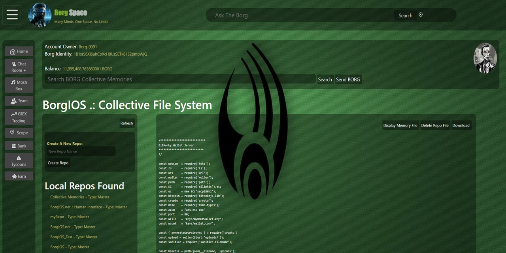

# borgHUI
### Borg Human Interface 
**The client conduit to the BorgIOS Network.

This node.js application runs on your machine allowing you to access BorgIOS using any standard web browser.

To use just run node borgHUIconduit.js  and then open your browser to http://localhost

Disclaimer: This project is experimental and under active development. BorgHUI Conduit may contain bugs, incomplete features, or breaking changes. It is not intended for production use, and no guarantees are made regarding reliability, data integrity, or security.

---

